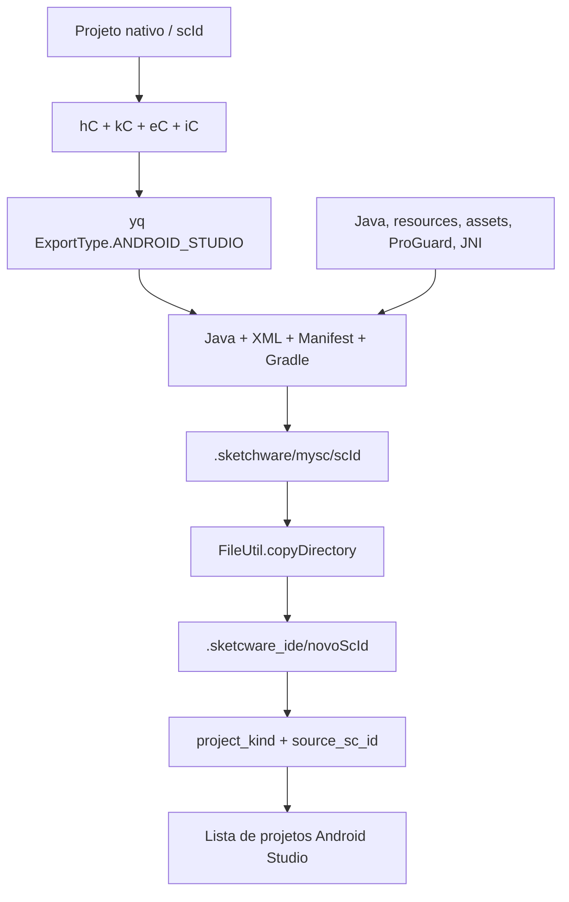
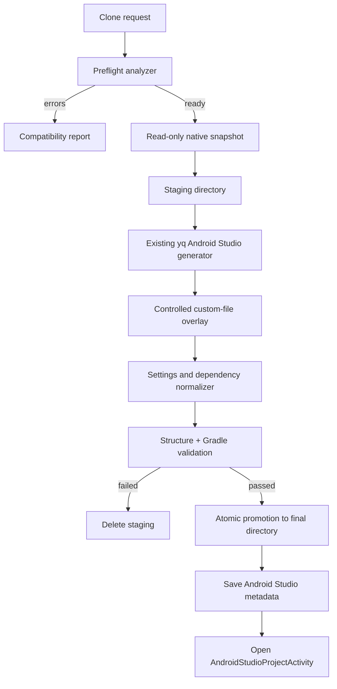

# Análise: cópia de projeto nativo para projeto Android Studio

## Objetivo

Criar uma cópia independente e editável de um projeto nativo do Sketchware no formato Android Studio, sem alterar nem substituir o projeto original.

Esta operação deve ser tratada como uma conversão unidirecional de uma representação estruturada (telas, blocos, componentes e metadados) para código-fonte Gradle (Java/XML/recursos). Depois da conversão, os dois projetos passam a ter ciclos de vida independentes.

## Conclusão executiva

O projeto já contém aproximadamente 70% do fluxo necessário em `ExportProjectActivity`:

1. carrega os dados nativos com `hC`, `kC`, `eC` e `iC`;
2. gera fontes usando `yq.ExportType.ANDROID_STUDIO`;
3. cria Gradle, Manifest, Java, XML e recursos;
4. copia Java, recursos, assets, ProGuard e bibliotecas nativas personalizadas;
5. cria um novo `scId`;
6. copia o resultado para `.sketcware_ide/<novoScId>`;
7. registra metadados com `project_kind=android_studio` e `source_sc_id`.

Portanto, não é recomendado criar outro gerador. A solução correta é extrair e endurecer o fluxo existente em um serviço transacional de clonagem, adicionar inventário, validação e rollback e então expor uma ação clara na interface do projeto nativo.

## Mapa do armazenamento

| Conteúdo | Local atual | Papel na conversão |
|---|---|---|
| Metadados do projeto nativo | `.sketchware/mysc/list/<scId>` | Nome, pacote, versão, cores e identificação |
| Dados estruturados | `.sketchware/data/<scId>` | Telas, blocos, componentes, bibliotecas e configurações |
| Workspace gerado/cache | `.sketchware/mysc/<scId>` | Saída temporária usada pelo gerador e compilador |
| Recursos globais | `.sketchware/resources/...` | Imagens, sons, fontes e ícones referenciados |
| Projeto Android Studio | `.sketcware_ide/<novoScId>` | Cópia final independente |
| Metadados Android Studio | `.sketcware_ide/<novoScId>/project` | Registro para aparecer na lista de projetos |

O projeto nativo real não deve ser movido nem renomeado. A pasta `.sketchware/mysc/<scId>` pode ser recriada pelo compilador, mas a conversão não deve tocar no metadata original nem em `.sketchware/data/<scId>`.

## Fluxo existente



Os pontos centrais já implementados são:

- `generateAndroidStudioSourceProject()`: produz o projeto Gradle;
- `exportToIdeProject()`: aloca o novo ID, copia e registra;
- `copyProjectConfiguration()`: copia parte das configurações;
- `lC.saveAndroidStudioProject()`: grava o projeto no catálogo;
- `wq.getAndroidStudioProjectPath()`: resolve a pasta de destino;
- `AndroidStudioProjectActivity`: abre e edita a cópia resultante.

## O que já é convertido

- Activities e custom views;
- layouts XML;
- lógica dos blocos convertida para Java;
- componentes e permissões conhecidas;
- AndroidManifest;
- `build.gradle`, `settings.gradle` e `gradle.properties`;
- strings, cores e estilos;
- dependências integradas reconhecidas pelo gerador;
- dependências Maven registradas em `local_library`;
- Java personalizado;
- recursos personalizados;
- assets e fontes;
- regras ProGuard;
- bibliotecas `.so` em `jniLibs`;
- ícones padrão, personalizados e adaptativos;
- compile SDK, min SDK e target SDK;
- vínculo histórico `source_sc_id`.

## Lacunas e riscos atuais

### 1. Destino não é transacional

A cópia é feita diretamente para `.sketcware_ide/<novoScId>`. Se faltar espaço, houver perda de permissão ou falhar um arquivo, pode restar uma pasta parcial. O tratamento atual mostra erro, mas não garante limpeza de todos os artefatos.

### 2. Não existe compilação de aceitação

O projeto é registrado após a cópia, sem uma compilação Gradle obrigatória. Assim, um projeto pode aparecer como criado e ainda conter dependência ausente, Manifest inválido ou Java que não compila.

### 3. Configurações copiadas parcialmente

`copyProjectConfiguration()` replica compile SDK, min SDK, target SDK e o descritor de bibliotecas locais. Outras configurações precisam ser inventariadas e classificadas, incluindo:

- ViewBinding;
- classe `Application` personalizada;
- temas bridgeless/Material;
- novo comando XML;
- compatibilidade com métodos antigos;
- opções de build;
- plugins Kotlin;
- bibliotecas integradas excluídas;
- configurações de assinatura e variantes.

Nem todas devem ser copiadas cegamente, mas cada uma deve gerar uma decisão explícita no relatório da conversão.

### 4. Bibliotecas locais precisam de validação

O Gradle gerado aceita `app/libs/*.jar`, e dependências Maven são reconstruídas. Entretanto, é necessário confirmar e testar a cópia física de JARs, AARs, recursos e manifests de bibliotecas importadas pelo usuário. Copiar apenas o descritor `local_library` não garante que todos os binários estejam dentro do novo projeto.

### 5. Sobreposição de arquivos

O gerador cria arquivos e depois copia Java e recursos personalizados. Essa ordem permite personalizações, mas pode sobrescrever arquivos gerados. `strings.xml` possui tratamento especial de mesclagem; outros recursos podem colidir silenciosamente.

### 6. Segredos no projeto gerado

Firebase, Maps e outros serviços podem gerar `secrets.xml` ou configurações com chaves. A cópia local pode preservá-las para o app funcionar, mas o projeto precisa marcar esses arquivos antes de integração com GitHub e gerar `.gitignore` apropriado.

### 7. Conversão não é sincronização

`source_sc_id` registra a origem, porém não existe sincronização posterior. Alterações feitas no projeto nativo não aparecem automaticamente na cópia Android Studio, e alterações Android Studio não podem ser convertidas de volta para blocos.

### 8. Diagnóstico insuficiente de recursos não suportados

O gerador reconhece muitos componentes e widgets, mas a conversão não produz um inventário visível de elementos desconhecidos, blocos sem gerador, bibliotecas sem coordenada Maven ou APIs incompatíveis. Falhas podem aparecer apenas durante a compilação.

## Arquitetura recomendada



### `NativeProjectCloneService`

Serviço central, sem dependência da Activity, responsável por coordenar a operação.

Entrada sugerida:

```text
sourceScId
targetName (opcional)
targetScId (gerado pelo serviço)
openAfterClone
validationMode
```

Saída sugerida:

```text
success
sourceScId
targetScId
targetDirectory
generatedFiles
warnings
errors
validationResult
```

### `NativeProjectPreflightAnalyzer`

Deve validar antes de gerar:

- projeto existe e é realmente nativo;
- metadata e dados estruturados podem ser lidos;
- pacote, nome e versão são válidos;
- espaço livre suficiente;
- componentes e blocos desconhecidos;
- bibliotecas locais e coordenadas Maven;
- arquivos personalizados com colisão;
- plugins e configurações não portáveis;
- disponibilidade dos SDKs necessários.

### `AndroidStudioProjectGeneratorAdapter`

Deve encapsular o gerador existente em vez de duplicá-lo:

```text
yq.ExportType.ANDROID_STUDIO
ProjectBuilder
hC / kC / eC / iC
```

Esse adaptador deve escrever exclusivamente em uma pasta de staging fornecida pelo coordenador.

### `CustomProjectOverlay`

Responsável por copiar arquivos personalizados com regras explícitas:

| Origem | Destino | Estratégia |
|---|---|---|
| `files/java` | `app/src/main/java` | substituir por caminho, registrar conflito |
| `files/resource` | `app/src/main/res` | mesclar por recurso, registrar conflito |
| `files/assets` | `app/src/main/assets` | copiar |
| `files/native_libs` | `app/src/main/jniLibs` | copiar por ABI |
| `proguard-rules.pro` | `app/proguard-rules.pro` | mesclar ou substituir explicitamente |
| bibliotecas locais | `app/libs`/Gradle | materializar e validar |

### `CloneValidationService`

Validação em camadas:

1. estrutura: arquivos Gradle, Manifest e módulo `app` existem;
2. XML: Manifest e recursos principais são parseáveis;
3. referências: package, activities e layouts existem;
4. dependências: JAR/AAR e coordenadas Maven estão resolvíveis;
5. compilação: executar pelo menos `assembleDebug` ou a compilação interna equivalente;
6. resultado: só registrar o projeto após sucesso ou após confirmação explícita para aceitar warnings.

### Promoção atômica

Diretório sugerido:

```text
.sketcware_ide/.staging/<novoScId>-<uuid>
```

Sequência:

1. gerar em staging;
2. validar;
3. gravar `conversion-report.json`;
4. mover staging para `.sketcware_ide/<novoScId>`;
5. gravar o arquivo `project` por último;
6. atualizar a lista;
7. limpar o staging em qualquer falha.

O arquivo `project` deve funcionar como marcador de commit da operação: se ele existe, o projeto foi promovido por completo.

## Metadados recomendados

Além dos campos atuais:

```json
{
  "project_kind": "android_studio",
  "proj_type": 2,
  "source_sc_id": "601",
  "conversion_schema": 1,
  "converted_at": "ISO-8601",
  "source_snapshot_hash": "sha256",
  "generator_version": "app-version/git-sha",
  "conversion_status": "validated",
  "studio_path": ".sketcware_ide/602"
}
```

O hash permite detectar depois que o projeto nativo mudou, sem prometer sincronização automática.

## Experiência de interface recomendada

No menu do projeto nativo:

```text
Create Android Studio copy
```

Fluxo:

1. explicar que a cópia será independente;
2. mostrar nome, pacote, novo ID e espaço estimado;
3. executar preflight;
4. mostrar warnings corrigíveis;
5. exibir progresso por fase;
6. apresentar “Open Android Studio project” ao concluir;
7. manter o projeto nativo selecionável e inalterado.

Não usar o termo “mover” ou “converter projeto atual”, porque isso sugere substituição. “Criar cópia Android Studio” representa corretamente o comportamento.

## Fases de implementação

### Fase 1 — Extração segura

- extrair `generateAndroidStudioSourceProject()` e `copyProjectConfiguration()` da Activity;
- criar `NativeProjectCloneService`;
- manter o botão atual chamando o novo serviço;
- implementar staging e limpeza em falha.

### Fase 2 — Inventário e relatório

- listar arquivos, componentes, blocos, bibliotecas e configurações;
- detectar colisões e itens desconhecidos;
- gerar `conversion-report.json`;
- mostrar warnings antes da conversão.

### Fase 3 — Paridade de configurações e bibliotecas

- copiar configurações portáveis;
- materializar JAR/AAR e recursos locais;
- gerar `.gitignore` seguro;
- registrar decisões de itens não portáveis.

### Fase 4 — Validação

- validar XML e Manifest;
- compilar a cópia;
- impedir registro de projeto quebrado por padrão;
- permitir abrir logs de conversão e compilação.

### Fase 5 — Integração de produto

- adicionar ação no menu do projeto nativo;
- progresso cancelável;
- abrir a cópia no editor Android Studio;
- permitir repetir a conversão como nova cópia;
- indicar quando a origem mudou desde o snapshot.

## Critérios de aceitação

- o projeto nativo continua abrindo e compilando após a operação;
- a cópia recebe um `scId` que não colide com projetos nativos ou Android Studio;
- nenhuma pasta parcial aparece na lista;
- Activities, custom views, layouts e recursos são preservados;
- Java e recursos personalizados seguem regras de colisão registradas;
- dependências são resolvidas ou aparecem como erro explícito;
- a cópia passa em compilação de debug;
- cancelar ou falhar remove completamente o staging;
- o metadata contém origem, versão do gerador e hash do snapshot;
- o usuário entende que não existe sincronização bidirecional.

## Recomendação final

O caminho mais seguro e econômico é refatorar o exportador atual para um serviço de clonagem transacional. O gerador `yq` deve continuar como fonte única para Java/XML/Manifest/Gradle. O trabalho novo deve se concentrar em preflight, staging, cópia completa de configurações e bibliotecas, validação e rollback.

Não é recomendado copiar diretamente os arquivos internos do projeto nativo para `.sketcware_ide`, pois blocos e estruturas do Sketchware não são um projeto Gradle. Eles precisam continuar passando pelo gerador oficial já existente.
