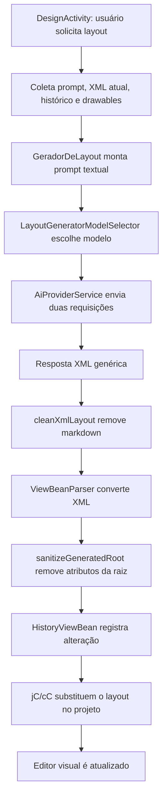
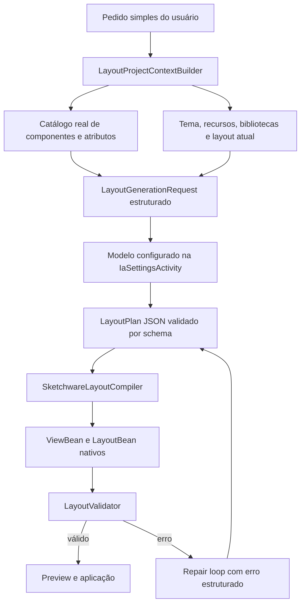

# Análise do Gerador de Layout com IA

## Resumo executivo

O gerador atual funciona, mas ainda está acoplado ao Sketchware de forma indireta. A IA produz um XML Android genérico e, somente depois da resposta, o aplicativo tenta converter esse XML para `ViewBean`, `LayoutBean` e atributos de raiz usados pelo editor visual.

Por isso, a percepção de que ele se comporta como uma adaptação ou “gambiarra” é tecnicamente correta. O modelo não conhece o estado real do projeto, as propriedades já assumidas pelo editor, as bibliotecas habilitadas, os componentes disponíveis naquele projeto nem as regras exatas usadas pelo `ViewBeanParser`.

É possível deixá-lo muito mais assertivo e reduzir bastante a quantidade de instruções do usuário. Para isso, o gerador deve deixar de depender apenas de prompt e passar a trabalhar com um contrato estruturado derivado do próprio Sketchware.

## Mapa atual



### Entrada e interface

O ponto de entrada está em `DesignActivity.launchAiGenerateLayout()`. A janela permite:

- informar uma descrição textual;
- incluir ou não o layout atual;
- selecionar imagens de referência;
- escrever observações sobre as imagens.

As imagens não são realmente enviadas ao modelo. O código envia apenas URI, nome e observações em formato textual. Portanto, o modelo não enxerga a referência visual.

### Coleta de contexto

`DesignActivity.generateAndApplyLayoutAsync()` coleta:

- ID do projeto;
- nome do XML;
- XML atual, quando solicitado;
- últimas gerações armazenadas;
- drawables cadastrados no projeto;
- texto associado às imagens de referência.

Não são coletados:

- configurações completas do projeto;
- bibliotecas AndroidX, Material ou AppCompat habilitadas;
- componentes instalados e coleções customizadas;
- atributos aceitos por cada componente;
- IDs existentes em outros layouts;
- estilos, temas, cores, strings e dimensões disponíveis;
- estrutura real de `ViewBean` e `LayoutBean`;
- regras de normalização usadas pelo editor;
- componentes que exigem configurações adicionais.

### Construção do prompt

`GeradorDeLayout.montarPromptBase()` cria um prompt fixo contendo:

- regras genéricas de Android XML;
- lista manual de layouts e widgets;
- lista limitada de drawables;
- histórico anterior;
- layout atual;
- solicitação do usuário.

A lista de componentes é escrita manualmente dentro da classe. Ela não é derivada do catálogo real do editor. Assim, pode ficar desatualizada ou incluir componentes indisponíveis no projeto.

### Escolha do modelo

`LayoutGeneratorModelSelector` seleciona aleatoriamente um modelo considerado adequado entre os modelos configurados na `IaSettingsActivity`.

Essa aleatoriedade reduz previsibilidade: duas solicitações idênticas podem usar modelos diferentes e produzir resultados com qualidade muito diferente.

A seleção global da `IaSettingsActivity` não é mais modificada temporariamente. O gerador agora passa provedor e modelo diretamente para a requisição, evitando interferência no chat ou em outras funcionalidades.

### Geração em duas passagens

O gerador realiza:

1. uma chamada para produzir o XML inicial;
2. outra chamada para refinar o XML.

A segunda chamada continua sendo baseada em instruções textuais. Não existe validação estruturada entre as passagens. Se o primeiro resultado contiver componentes ou atributos incompatíveis, o segundo modelo pode apenas reorganizar o mesmo erro.

### Conversão para Sketchware

Depois da resposta, `DesignActivity.prepareGeneratedLayout()` usa `ViewBeanParser` com `skipRoot=true`.

O parser converte as tags XML em objetos `ViewBean`. A raiz é tratada separadamente por `InjectRootLayoutManager`.

Antes de aplicar, `sanitizeGeneratedRoot()` remove:

- padding da raiz;
- margens da raiz;
- background da raiz;
- stroke e background de Card;

Também força largura e altura da raiz para `match_parent`.

Isso comprova que o modelo gera propriedades que o próprio sistema considera inadequadas e que o aplicativo precisa corrigi-las depois.

### Aplicação no projeto

O layout convertido é aplicado através de:

- `InjectRootLayoutManager`, para a raiz;
- `HistoryViewBean`, para histórico/undo;
- `cC`, para estado e histórico do editor;
- `jC`, para armazenamento do layout ativo;
- atualização do adapter da aba visual.

Essa etapa está integrada ao Sketchware. A fragilidade está antes dela: a IA não gera diretamente conforme o contrato interno que essa etapa espera.

## Problemas principais

### 1. O contrato da IA é XML Android genérico

O modelo recebe orientações textuais e devolve texto livre. Não existe schema para limitar tags, atributos, IDs ou hierarquia.

### 2. Catálogo de componentes duplicado

`GeradorDeLayout.getViewBeanParserSupportedTypes()` mantém uma lista manual. O catálogo real já existe no editor, nas factories, palettes e propriedades dos componentes.

### 3. Ausência de catálogo de atributos

O modelo sabe quais componentes pode usar, mas não quais atributos cada componente suporta no Sketchware. Isso explica propriedades desnecessárias ou inválidas.

### 4. Valores padrão não são informados

O modelo repete propriedades que o Sketchware já define automaticamente, como dimensões, orientação, gravity, estilos ou configuração da raiz.

### 5. Aleatoriedade do modelo

Escolher um modelo aleatório prejudica consistência e dificulta reproduzir bugs. Deve existir um modelo específico para geração de layout ou usar explicitamente o modelo global escolhido na `IaSettingsActivity`.

### 6. Imagens não são multimodais

As imagens selecionadas não chegam ao provedor. Apenas seus nomes e observações são enviados. A interface cria expectativa de análise visual que o fluxo atual não atende.

### 7. Histórico guarda XML completo

Até dez respostas anteriores podem entrar no prompt. Isso aumenta tokens, mistura decisões antigas e pode fazer o modelo copiar estruturas que já não correspondem ao pedido atual.

### 8. Não existe validação antes da aplicação

O fluxo verifica se há XML e se o parser retornou views, mas não executa uma validação semântica completa:

- IDs duplicados;
- componentes indisponíveis;
- atributos incompatíveis;
- referências inexistentes;
- dependências necessárias;
- hierarquia inválida;
- conflitos relativos;
- propriedades redundantes.

### 9. Erros não retornam ao modelo

Quando `ViewBeanParser` ou a aplicação falha, o erro é mostrado ao usuário. Não existe uma rodada automática de reparo enviando ao modelo o erro exato do parser.

## Arquitetura recomendada



### LayoutProjectContextBuilder

Deve ler diretamente do projeto:

- componentes realmente disponíveis;
- bibliotecas habilitadas;
- tema Material/AppCompat;
- recursos existentes;
- root configurado;
- layout atual convertido em representação compacta;
- IDs já utilizados;
- propriedades padrão do editor.

### LayoutComponentRegistry

Deve substituir a lista manual. Cada componente precisa declarar:

- nome usado no editor;
- tag XML correspondente;
- tipo de container ou widget;
- filhos permitidos;
- atributos aceitos;
- propriedades padrão que não devem ser geradas;
- dependências necessárias;
- alternativas quando o componente não estiver disponível.

### Saída estruturada

A IA deveria retornar inicialmente JSON, não XML livre. Exemplo:

```json
{
  "root": {
    "type": "LinearLayout",
    "orientation": "vertical"
  },
  "views": [
    {
      "type": "TextView",
      "id": "text_title",
      "text": "Título",
      "width": "match_parent",
      "height": "wrap_content"
    }
  ]
}
```

O aplicativo validaria esse JSON e o converteria diretamente para `ViewBean`/`LayoutBean`. O XML seria uma saída derivada, não o contrato principal.

### LayoutDefaultsPolicy

Uma política local deve remover propriedades redundantes antes de aplicar:

- não gerar atributos iguais aos defaults do Sketchware;
- não estilizar a raiz sem solicitação;
- não criar wrappers sem necessidade;
- não adicionar toolbar, actionbar ou containers externos automaticamente;
- não declarar recursos já herdados do tema;
- manter apenas atributos relevantes ao pedido.

### LayoutValidator

Deve validar antes de tocar no projeto:

- schema da resposta;
- componentes e atributos;
- IDs;
- referências de recursos;
- hierarquia;
- compatibilidade com bibliotecas;
- conversão completa para beans;
- dependências circulares em layouts relativos.

### Repair loop

Quando houver erro, o sistema deve enviar automaticamente ao modelo:

- pedido original;
- saída estruturada;
- erro exato;
- componente e propriedade responsáveis;
- lista de alternativas aceitas.

O usuário não deve precisar ensinar manualmente como corrigir o mesmo tipo de problema.

## Como reduzir as instruções do usuário

O usuário deveria poder escrever apenas algo como:

> Tela de login moderna com logo, e-mail, senha e botão entrar.

O contexto interno acrescentaria automaticamente:

- componente root correto;
- tema ativo;
- componentes disponíveis;
- padrões de espaçamento;
- recursos existentes;
- defaults do Sketchware;
- restrições de atributos;
- layout atual, quando for uma edição;
- regras para IDs e hierarquia.

Assim, conhecimento técnico deixa de ser responsabilidade do usuário e passa a ser responsabilidade do sistema.

## Plano de implementação

### Fase 1 — Fundação

1. Criar `LayoutGenerationRequest`.
2. Criar `LayoutProjectContextBuilder`.
3. Extrair o catálogo real para `LayoutComponentRegistry`.
4. Remover a lista manual de componentes do prompt.
5. Tornar a escolha do modelo determinística e configurável na `IaSettingsActivity`.

### Fase 2 — Validação

1. Criar `LayoutGenerationValidator`.
2. Validar IDs, tags, atributos, recursos e hierarquia.
3. Produzir erros estruturados.
4. Impedir aplicação parcial de layouts inválidos.

### Fase 3 — Compilador nativo

1. Definir schema JSON do layout.
2. Criar `SketchwareLayoutCompiler` para gerar `ViewBean` e `LayoutBean`.
3. Usar XML apenas para importação/exportação.
4. Criar preview antes da aplicação definitiva.

### Fase 4 — Autocorreção

1. Adicionar repair loop automático.
2. Limitar tentativas.
3. Revalidar cada correção.
4. Registrar erro e correção para diagnóstico, sem poluir o prompt principal.

### Fase 5 — Multimodal real

1. Detectar capacidade visual do modelo selecionado.
2. Enviar imagens como conteúdo multimodal.
3. Ocultar ou explicar a limitação quando o modelo não aceitar imagens.

## Prioridade recomendada

A melhoria de maior impacto é criar o `LayoutProjectContextBuilder` e o `LayoutComponentRegistry`. Isso já permite manter XML como saída temporariamente, mas fornece ao modelo informações reais do Sketchware e reduz componentes e atributos incorretos.

Depois, deve ser criado o validator com repair loop. A migração para geração direta de beans pode ocorrer por último, pois é a etapa mais invasiva.

## Remoção do Fix com IA

O antigo fluxo “Fix com IA” ainda estava presente e ativo. Foram removidos:

- botão `aiFixButton` do log de compilação;
- abertura automática do editor lógico por sessão de correção;
- estado `ai_fix_session_id` no `LogicEditorActivity`;
- aplicação automática de mudanças em blocos;
- classes `AiFixSupport`, `AiFixSuggestion`, `AiFixSession` e `AiFixSessionStore`;
- strings e referências associadas.

A função “Explicar erro com IA” foi preservada porque apenas analisa o log e não modifica blocos nem inicia o fluxo excluído.

## Validação

Após a remoção do Fix com IA:

- busca global sem referências restantes a `AiFix` ou `ai_fix`;
- `:app:compileDebugJavaWithJavac` concluído com sucesso.

## Conclusão

O gerador atual já consegue aplicar layouts no estado interno do editor, mas sua geração ainda é externa ao modelo nativo do Sketchware. A assertividade não será resolvida apenas aumentando o prompt. A solução é transformar conhecimento do projeto, componentes, atributos e defaults em contexto e validação programática.

Com essa arquitetura, o usuário descreve a intenção visual e o sistema assume o conhecimento técnico necessário para produzir um layout compatível.

## Atualização: cinco fases implementadas

As cinco fases recomendadas foram aplicadas em conjunto:

1. `LayoutComponentRegistry` deriva o catálogo dos tipos internos de `ViewBean` e aliases suportados.
2. `LayoutProjectContext` reúne layout atual, defaults do Sketchware, recursos e referências.
3. `SketchwareLayoutCompiler` recebe contrato JSON estruturado e produz XML compatível com `ViewBeanParser`.
4. `LayoutGenerationValidator` bloqueia componentes, IDs e recursos inválidos; o gerador executa até duas correções automáticas usando o erro real.
5. Imagens são enviadas como conteúdo multimodal para modelos compatíveis de OpenAI, Anthropic e Gemini; modelos sem visão recebem fallback textual explícito.

O modelo usado deixou de ser aleatório e agora respeita a seleção atual da `IaSettingsActivity`. O APK debug completo foi gerado com sucesso após a integração.
