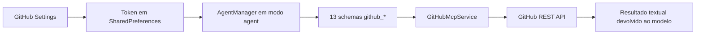
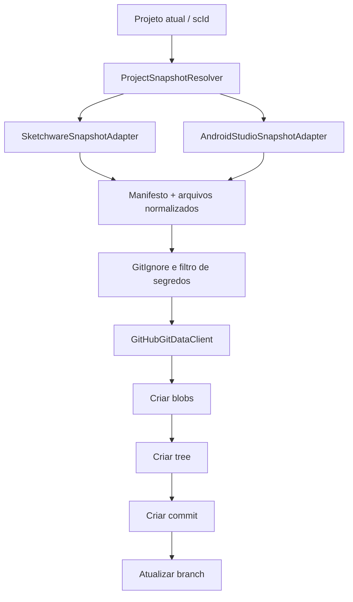

# Análise da integração GitHub no Sketchware-IA

## Resumo

A integração atual funciona como um conjunto nativo de ferramentas REST para o agente de IA. Ela permite consultar repositórios, branches, arquivos, código, issues, pull requests e commits, além de criar issue, pull request e criar/atualizar um único arquivo.

Isso é útil para pesquisa e manutenção remota, mas ainda não equivale a versionar um projeto Sketchware ou Android Studio inteiro. Não há associação persistente entre projeto e repositório, captura do estado completo, commit em lote, push/pull, diff local/remoto ou resolução de conflitos.

## Mapa da implementação atual

- `GithubSettingsActivity`: recebe e salva o token.
- `AgentManager`: disponibiliza as ferramentas somente no modo agente e somente quando existe token.
- `GitHubMcpService`: executa chamadas REST nativas. O token não entra no prompt enviado ao modelo.
- Ferramentas atuais: listar repositórios, detalhes, branches, arquivos, pesquisa de código, issues, pull requests e commits; criar issue/PR; criar ou atualizar um arquivo.

## Comparação com o Void

O Void possui uma camada MCP genérica: lê configuração de servidores, inicia clientes MCP, descobre ferramentas dinamicamente, pede aprovação e despacha chamadas. O acesso ao GitHub pode vir de um servidor MCP de GitHub. Além disso, por ser baseado no VS Code, ele já trabalha sobre uma pasta real e conta com Git/SCM do editor.

O Sketchware-IA adotou uma solução adequada para Android: um cliente REST embutido, sem depender de iniciar processos Node/stdio no aparelho. A limitação não é usar REST; é faltar uma camada de versionamento de projetos acima do cliente REST.

## Projetos que podem ser versionados

### Projeto Android Studio

Sim. É o caso mais direto, pois já existe como árvore normal de arquivos. O sincronizador deve ignorar `.gradle/`, `build/`, `.idea/caches`, APKs, arquivos locais e segredos, e enviar o restante em um commit único.

### Projeto nativo Sketchware

Também é possível, mas precisa de um adaptador. O projeto não é apenas uma pasta Gradle: seus dados estão distribuídos nas áreas internas do Sketchware e podem conter formatos próprios. O snapshot deve reunir metadados, telas, lógicas/blocos, recursos, bibliotecas e fontes em uma estrutura estável. Na restauração, o processo inverso deve validar a versão do formato antes de substituir dados locais.

## Arquitetura recomendada

Componentes necessários:

1. `ProjectRepositoryBinding`: guarda por `scId` o owner, repo, branch, tipo do projeto e último SHA sincronizado.
2. `ProjectSnapshotResolver`: seleciona o adaptador nativo ou Android Studio.
3. `SketchwareSnapshotAdapter`: exporta e restaura o formato nativo de maneira determinística.
4. `AndroidStudioSnapshotAdapter`: percorre a árvore e aplica regras de exclusão.
5. `SecretScanner`: bloqueia token, `local.properties`, keystores e credenciais antes do envio.
6. `GitHubGitDataClient`: usa blobs, trees, commits e refs para gerar um único commit por snapshot.
7. `ProjectSyncCoordinator`: status, diff, push, pull, histórico, conflito e progresso/cancelamento.
8. UI por projeto: Conectar repositório, Criar repositório, Commit/Push, Pull, Histórico e Desconectar.

## Por que não usar a ferramenta atual de arquivo único

`github_create_or_update_file` usa a Contents API e cria um commit por arquivo. Em um projeto real isso produz centenas de commits, aumenta a chance de estado parcial e torna falhas difíceis de recuperar. O Git Data API permite criar blobs e uma árvore e publicar todo o snapshot em um commit atômico.

## Segurança

- O token deve continuar fora do prompt da IA.
- Prefira armazenamento criptografado pelo Android Keystore em vez de `SharedPreferences` simples.
- Use token fine-grained limitado aos repositórios necessários e permissões mínimas de Contents/Pull requests/Issues.
- Nunca envie `local.properties`, keystore, chaves de assinatura, arquivos `.env` ou preferências contendo APIs.
- Operações destrutivas e force-push devem exigir confirmação explícita.

## Ordem de implementação

1. Criar repositório e vínculo projeto-repositório.
2. Implementar snapshot Android Studio e commit atômico.
3. Implementar snapshot/restauração do formato nativo Sketchware.
4. Adicionar pull, diff e detecção de conflito por SHA.
5. Expor ações na UI e ferramentas controladas para o agente.

## Estado implementado

A primeira etapa foi implementada exclusivamente para projetos Android Studio:

- ação GitHub no editor Android Studio;
- criação ou conexão de repositório;
- vínculo persistente por `scId`, marcado como `android_studio`;
- snapshot com exclusão de builds, caches e segredos;
- blobs, tree, commit e atualização de ref pela Git Data API;
- um commit atômico por snapshot;
- proteção contra avanço remoto da branch após o último push;
- criação de repositório e branch também disponível como ferramenta do agente.

Pull/restauração remota e versionamento do formato nativo Sketchware permanecem fora desta etapa.

## Conclusão

A API/token já configurados são suficientes para autenticar o recurso. Não é necessário incorporar Git completo no APK para a primeira versão. A melhor evolução é manter o cliente REST atual para pesquisa e adicionar uma camada separada de snapshot e Git Data API para versionamento. Assim, pesquisa do agente e sincronização de projetos permanecem responsabilidades claras e testáveis.
