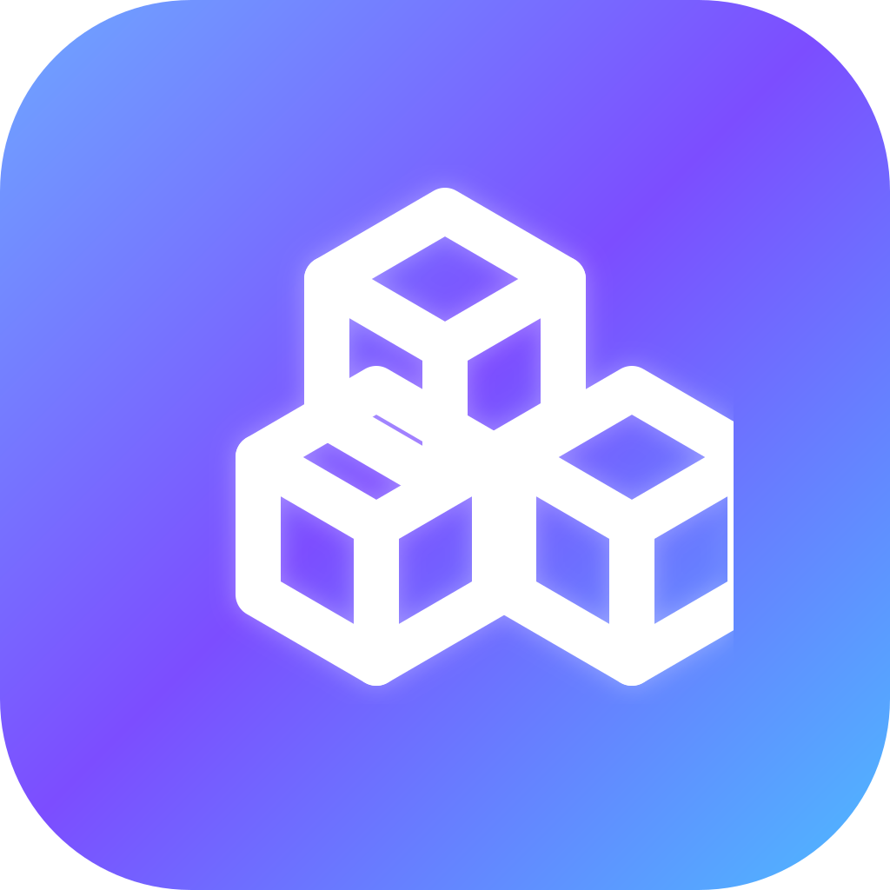

Sketchware IA

  

<h3 align="center">
  Crie apps Android direto do celular com blocos, Java/Kotlin e inteligência artificial.
</h3>

  O <strong>Sketchware IA</strong> é uma IDE mobile baseada no Sketchware, mantida pela comunidade, com foco em editor visual, desenvolvimento Android no celular e integração com IA.

  <a href="https://github.com/FabioSilva11/Sketchware-IA/releases">
    <strong>Baixar APK</strong>
  </a>
  ·
  <a href="#como-contribuir">
    <strong>Contribuir</strong>
  </a>
  ·
  <a href="#roadmap">
    <strong>Roadmap</strong>
  </a>
  ·
  <a href="https://github.com/FabioSilva11/Sketchware-IA/issues">
    <strong>Reportar bug</strong>
  </a>

  
  
  
  
  
  

---
✨ O que é o Sketchware IA?

O Sketchware IA é uma continuação moderna do Sketchware para Android, criada para permitir que pessoas desenvolvam aplicativos diretamente pelo celular.

A proposta é unir:

- editor visual com blocos;
- desenvolvimento Android com Java/Kotlin;
- assistente de IA integrado;
- correção de erros de código;
- geração de funcionalidades;
- compilação de APK no próprio dispositivo;
- comunidade colaborativa para manter o projeto vivo.

«O objetivo é transformar o celular em um ambiente real de desenvolvimento mobile.»

---

🚀 Por que este projeto existe?

Muita gente quer criar aplicativos Android, mas nem todo mundo tem acesso a um computador potente, Android Studio ou uma estrutura profissional de desenvolvimento.

O Sketchware IA nasce para resolver isso:

«Criar, editar, corrigir e compilar apps Android direto do celular, com ajuda de IA.»

Este projeto busca manter viva a ideia do Sketchware original, mas com uma visão mais moderna: inteligência artificial, colaboração, versionamento, novos blocos, melhorias no editor e uma comunidade ativa de desenvolvimento.

---

📱 Demonstração

https://github.com/user-attachments/assets/651ff6f4-8d62-4327-a524-92030e795eb3

Ideias para o GIF:

- criando um novo projeto;
- usando blocos visuais;
- pedindo ajuda para a IA;
- corrigindo um erro de compilação;
- gerando um APK no próprio celular.

---

🔥 Recursos principais

🧩 Editor visual com blocos

Crie interfaces e lógicas de aplicativo usando blocos visuais, eventos e componentes Android.

💻 Java e Kotlin

Use código customizado em Java/Kotlin para expandir seus projetos além dos blocos tradicionais.

🤖 IA integrada

Use inteligência artificial para:

- gerar código;
- explicar erros;
- sugerir melhorias;
- refatorar trechos;
- criar funcionalidades;
- ajudar na criação de módulos.

🛠️ Correção de erros

O objetivo é permitir que a IA ajude a interpretar erros de build e sugira correções diretamente no ambiente mobile.

📦 Compilação no Android

Crie, compile e teste seus projetos Android diretamente no celular.

🌎 Projeto mantido pela comunidade

O Sketchware IA é mantido por pessoas interessadas em desenvolvimento Android mobile, IA, ferramentas visuais e educação tecnológica.

---

📥 Instalação

Baixe a versão mais recente na página de releases:

👉 "Download do APK" (https://github.com/FabioSilva11/Sketchware-IA/releases)

«Recomendação: baixe APKs apenas pela página oficial de Releases deste repositório.»

---

⚡ Como usar

1. Baixe e instale o APK.
2. Abra o Sketchware IA.
3. Crie um novo projeto.
4. Monte a interface usando o editor visual.
5. Use blocos, Java ou Kotlin para criar a lógica.
6. Peça ajuda para a IA quando precisar.
7. Compile e teste seu aplicativo no próprio Android.

---

👨‍💻 Para desenvolvedores

O projeto é uma oportunidade para contribuir com uma ferramenta real usada por pessoas que criam apps pelo celular.

Você pode contribuir com:

- Android;
- Java;
- Kotlin;
- UI/UX;
- IA e prompts;
- correção de bugs;
- performance;
- documentação;
- testes;
- novos blocos;
- ferramentas MCP;
- integração com GitHub;
- melhorias no sistema de build.

---

🧭 Roadmap

✅ Atual

- Continuação comunitária do Sketchware.
- Editor visual Android.
- Suporte a blocos.
- Suporte a Java/Kotlin.
- Builds e releases no GitHub.
- Integração inicial com recursos de IA.

🔜 Próximos passos

- Melhorar onboarding para novos usuários.
- Criar exemplos e templates prontos.
- Melhorar estabilidade do editor.
- Melhorar o assistente de IA.
- Criar documentação para contribuidores.
- Organizar issues com "good first issue".
- Melhorar sistema de feedback e reporte de bugs.
- Publicar changelogs mais detalhados nas releases.

🧠 IA e automação

- Melhorar prompts de correção de erro.
- Criar ferramentas para análise de projeto.
- Permitir sugestões automáticas de código.
- Explorar integrações com MCP.
- Criar fluxos para IA auxiliar em commits, PRs e documentação.

🔗 Integração com GitHub

Funcionalidade planejada para transformar o Sketchware IA em um ambiente de desenvolvimento mobile com versionamento completo.

Ideias previstas:

- login com GitHub;
- criação de repositórios;
- backup automático dos projetos;
- histórico de versões;
- commits automáticos;
- comparação de mudanças;
- colaboração via pull requests.

🔮 Futuro: migração para Flutter

Existe uma visão de longo prazo para migrar gradualmente o Sketchware IA para Flutter/Dart, modernizando a interface e permitindo expansão futura para múltiplas plataformas.

Possibilidades futuras:

Plataforma| Objetivo
Android| Suporte principal
Web| Planejado
Windows| Planejado
Linux| Planejado
macOS| Planejado
iOS| Planejado

«Importante: a base atual em Java/Kotlin continua ativa e seguirá recebendo melhorias.»

---

🗂️ Estrutura rápida do projeto

Sketchware-IA/
├── app/                  # Código principal do app Android
├── assets/               # Recursos auxiliares
├── gradle/               # Configurações do Gradle
├── scripts/              # Scripts auxiliares
├── .github/              # Workflows, templates e automações
├── build.gradle          # Configuração principal de build
├── settings.gradle       # Configuração dos módulos
├── CONTRIBUTING.md       # Guia de contribuição
├── LICENSE.md            # Licença e observações legais
└── README.md             # Documentação principal

«Uma documentação mais completa da arquitetura pode ser criada em "ARCHITECTURE.md".»

---

🧑‍🤝‍🧑 Como contribuir

Contribuições são bem-vindas.

1. Escolha uma tarefa

Veja as issues abertas:

👉 "Issues do projeto" (https://github.com/FabioSilva11/Sketchware-IA/issues)

Boas primeiras contribuições devem ser marcadas com:

- "good first issue"
- "help wanted"
- "documentation"
- "ui/ux"
- "bug"
- "android"
- "ai"

2. Faça um fork

git clone https://github.com/FabioSilva11/Sketchware-IA.git
cd Sketchware-IA

3. Crie uma branch

git checkout -b feat/minha-funcionalidade

4. Faça sua alteração

Mantenha o foco em uma mudança por pull request.

Exemplos:

fix: corrigir crash ao abrir projeto antigo
feat: adicionar novo bloco visual
docs: melhorar instruções de build
refactor: organizar módulo de IA

5. Abra um Pull Request

No PR, explique:

- o que foi alterado;
- por que a mudança é necessária;
- como testar;
- prints ou vídeos, se houver mudança visual.

---

🧪 Build do projeto

Pré-requisitos

- Android Studio Hedgehog ou superior;
- JDK 17;
- Android SDK 35;
- Gradle configurado corretamente.

Compilar localmente

git clone https://github.com/FabioSilva11/Sketchware-IA.git
cd Sketchware-IA
./gradlew assembleDebug

No Windows:

gradlew.bat assembleDebug

---

🔐 Variáveis de ambiente para CI

Variável| Descrição
"SKETCHUB_API_KEY"| Chave da API do Sketchub, opcional
"KEYSTORE_FILE"| Keystore em base64 para assinar o APK
"KEY_ALIAS"| Alias da chave
"KEY_PASSWORD"| Senha da chave
"KEYSTORE_PASSWORD"| Senha do keystore

«Nunca publique chaves privadas, tokens ou credenciais pessoais no repositório.»

---

🛡️ Segurança dos APKs

Para segurança dos usuários:

- baixe o APK apenas pela aba oficial de Releases;
- verifique se o APK veio deste repositório;
- evite builds compartilhados por terceiros;
- sempre que possível, confira o hash/checksum publicado na release.

Sugestão para releases futuras:

SHA-256:
adicione_aqui_o_hash_do_apk

---

🤖 Use IA para contribuir

Você pode usar inteligência artificial para ajudar no desenvolvimento do próprio Sketchware IA.

A IA pode ajudar a:

- entender partes antigas do código;
- documentar classes;
- sugerir refatorações;
- criar testes;
- gerar novos blocos;
- melhorar prompts;
- revisar pull requests;
- criar exemplos;
- escrever tutoriais.

A ideia do projeto é justamente expandir os limites do desenvolvimento mobile usando IA.

---

📢 Ajude a divulgar

Se você acredita no projeto, ajude compartilhando.

Sugestão de texto:

Conheça o Sketchware IA 🚀

Uma IDE Android com blocos visuais, Java/Kotlin e inteligência artificial, criada para desenvolver apps direto do celular.

O projeto é mantido pela comunidade e está buscando contribuidores em Android, Java, Kotlin, IA, UI/UX e documentação.

GitHub:
https://github.com/FabioSilva11/Sketchware-IA

---

📌 Ideias para primeiras contribuições

Se você quer contribuir mas não sabe por onde começar, aqui estão algumas ideias:

- melhorar este README;
- criar README em inglês;
- criar screenshots do app;
- criar GIF de demonstração;
- revisar textos da interface;
- corrigir bugs simples;
- criar templates de projetos;
- documentar o sistema de build;
- melhorar mensagens de erro;
- criar exemplos de uso da IA;
- testar o app em versões diferentes do Android.

---

⚖️ Licença

O Sketchware IA é um projeto source-available, não um projeto open source convencional.

Leia o arquivo "LICENSE.md" (LICENSE.md) antes de reutilizar código fora deste repositório.

Algumas partes do projeto têm origem em bases anteriores do ecossistema Sketchware, então a reutilização em projetos externos deve ser feita com cuidado.

---

❤️ Comunidade

Este projeto existe porque a comunidade ainda acredita no potencial de criar aplicativos Android direto do celular.

Se você é desenvolvedor, estudante, designer, criador de conteúdo ou entusiasta de IA, sua contribuição pode ajudar a tornar o Sketchware IA melhor para todos.

  <a href="https://github.com/FabioSilva11/Sketchware-IA/releases">Baixar APK</a>
  ·
  <a href="https://github.com/FabioSilva11/Sketchware-IA/issues">Reportar bug</a>
  ·
  <a href="https://github.com/FabioSilva11/Sketchware-IA/pulls">Contribuir</a>

  Feito com ❤️ pela comunidade Sketchware IA

